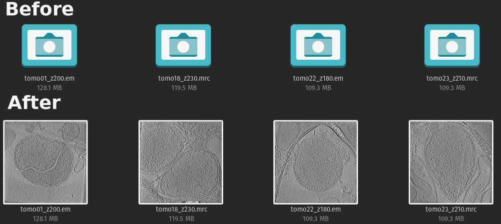

# mrc-em-gnome-thumbnailer

GNOME desktop thumbnailer for MRC2014 (*.mrc) and EM (*.em), common cryo-electron tomography file formats. The thumbnail shows central slice and automatically applies contrast stretching.

Update 22.12.2021: Added support for .em files, renamed the project.

Tested on Ubuntu/PopOS 20.04, 20.10, 21.04, 21.10.



# Installation
1. Quit all Nautilus processes: `nautilus -q`
   - __Even if you currently do not have any Nautilus windows open, you should run the command above!__
2. Delete thumbnails folder: `rm -r ~/.cache/thumbnails`
3. Clone the repository: `git clone git@github.com:the-lay/mrc-em-gnome-thumbnailer.git tomo-thumbnailer`
4. Change directory: `cd tomo-thumbnailer`
5. Run make install: `sudo make install`
   - The script uses PIP to install necessary python packages. If you do not have system-wide pip installation,
    please setup it first with `sudo apt install python3-pip`.
     
From now on, the thumbnails should be visible.

# Troubleshooting
#### Thumbnails do no show up on some Ubuntu-based distributions 18.04 and later
Most likely it is a problem with bubblewrap 
([1](https://askubuntu.com/questions/1279091/nautilus-thumbnailer-for-ms-office-documents-in-ubuntu-20),
[2](https://askubuntu.com/questions/1088539/custom-thumbnailers-don-t-work-on-ubuntu-18-10-and-18-04),
and many more threads online). The short workaround fix would be to install a bwrap wrapper in `/usr/local/bin`:
```
sudo wget -O /usr/local/bin/bwrap https://raw.githubusercontent.com/NicolasBernaerts/ubuntu-scripts/master/nautilus/bwrap
sudo chmod +rx /usr/local/bin/bwrap
```
I strongly do *not* recommend this workaround.
Instead, consider updating to the latest version of Ubuntu, where this issue is already fixed.
